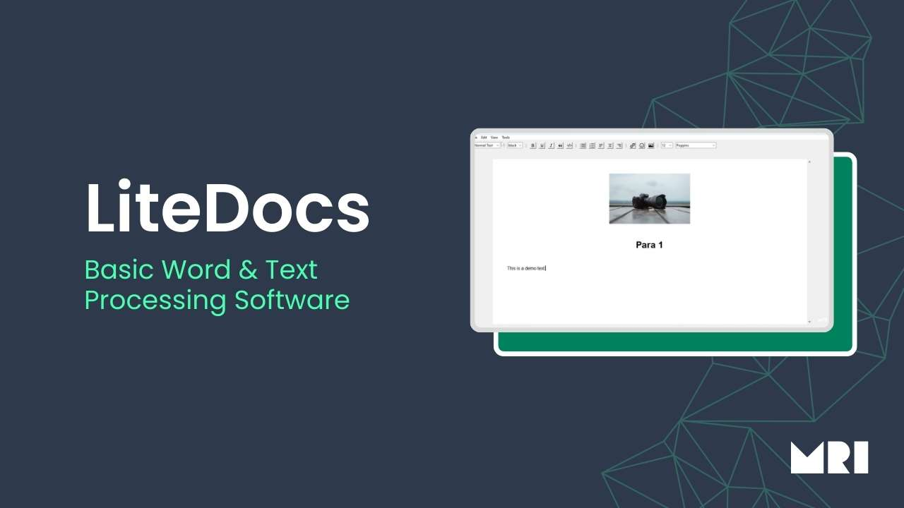

# LiteDocs

Welcome to LiteDocs, a lightweight and user-friendly text editor designed for effortless writing and editing. Crafted using the Python language, this software boasts a charming interface built with the tkinter module.

**Note:** While LiteDocs is functional, it's currently in development, and there may be lingering bugs. We're continuously working to improve its scalability and polish before releasing it as an .exe package.

## Features
- Intuitive interface for seamless document creation
- Essential features for quick drafts, simple edits, and hassle-free writing tasks
- Built with Python and the tkinter module for reliability and charm

## Usage
1. Clone the repository: `git clone https://github.com/yourusername/LiteDocs.git`
2. Run LiteDocs using Python: `python app.py`
3. Start writing and editing your documents effortlessly!

## Contributing
Contributions are welcome! Whether you're interested in fixing bugs, adding new features, or improving documentation, feel free to submit a pull request.

## Roadmap
- Enhance scalability and performance
- Fix lingering bugs and improve stability
- Add additional features based on user feedback

## License
This project is licensed under the [GNU General Public License (GPL)](LICENSE).

---

Thank you for using LiteDocs! We hope it simplifies your document creation process.

